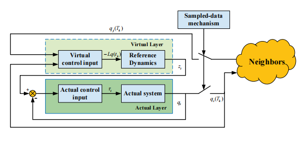
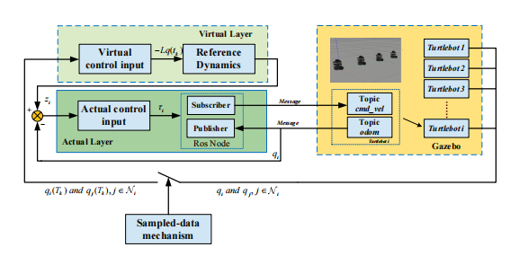
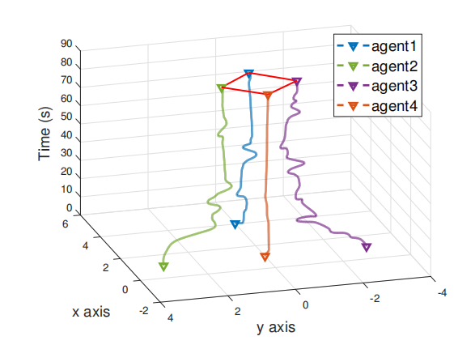
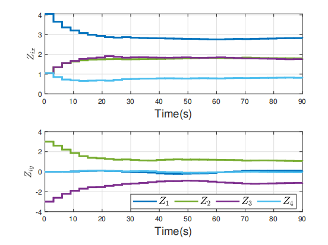

# Adaptive Fuzzy Consensus of Multiple Uncertain Euler-Lagrange Systems With Sampled-Data Output Interactions

This repository contains the implementation of the paper **"Adaptive Fuzzy Consensus of Multiple Uncertain Euler-Lagrange Systems With Sampled-Data Output Interactions"**.

The project investigates the consensus problem for a class of multi-agent systems (MASs) described by Euler-Lagrange (EL) dynamics. It proposes a novel dual-layer protocol that handles unknown regression matrices and allows for **sampled-data output interaction only** (no continuous communication or velocity measurements required).

## 📝 Abstract

Multi-agent systems governed by Euler-Lagrange dynamics (e.g., robotic manipulators, UAVs) often face challenges such as high nonlinearity, model uncertainties, and communication constraints. This work proposes a distributed control protocol synthesized by integrating:
*   **Sampled-data cooperative control**: Agents only exchange position data at discrete sampling instants.
*   **Virtual Trajectory Layer**: A first-order difference trajectory generator updates exclusively at sampling instants.
*   **Adaptive Fuzzy Control**: Handles the unknown regression matrix and external disturbances.
*   **Fixed-time Control**: Ensures timely convergence of the tracking error.

The effectiveness is validated through both Numerical Simulations (MATLAB) and ROS Experiments (Gazebo with Turtlebot3).

## 🏗️ System Architecture

The proposed control framework consists of a **Virtual Layer** and an **Actual Layer**. This achieves a separation between the design of virtual trajectory dynamics and the specific agent input.

*Fig. 1: Block diagram of the consensus protocol featuring the dual-layer structure.*

### Key Features
1.  **Privacy & Efficiency**: Agents share only output (position) data, not internal states or velocities.
2.  **Robustness**: Uses Fuzzy Logic Systems (FLS) to approximate unknown dynamics (unknown mass/inertia matrices).
3.  **Sampled-Data**: Works with discrete-time communication, reducing network load.
4.  **Fixed-Time Convergence**: Guarantees tracking errors converge within a bounded time independent of initial conditions.

## 🤖 ROS Implementation

The algorithms are implemented in **ROS (Robot Operating System)** to validate performance in a realistic physics engine (Gazebo).

*Fig. 2: The block diagram of the proposed protocol for ROS implementation.*

*   **Virtual Layer**: Generates high-level reference commands via topics.
*   **Actual Layer**: Subscribes to `odom` and publishes to `cmd_vel` for Turtlebots.
*   **Communication**: Modeled via a custom topology node handling sampled data.

## 📊 Results

### 3D Trajectories
The agents successfully achieve consensus and formation control despite uncertainties and sampled communications.

*Fig. 3: The 3D trajectories of four agents achieving a parallelogram formation.*

### Virtual Reference Trajectories
The virtual layer ensures that reference signals reach consensus based on the communication topology.

*Fig. 4: Evolution of virtual reference trajectories in x and y axes.*
